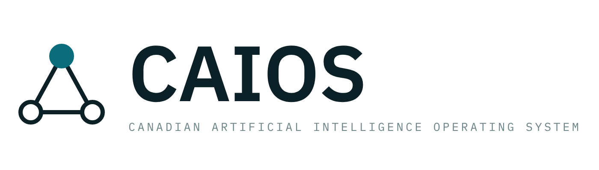
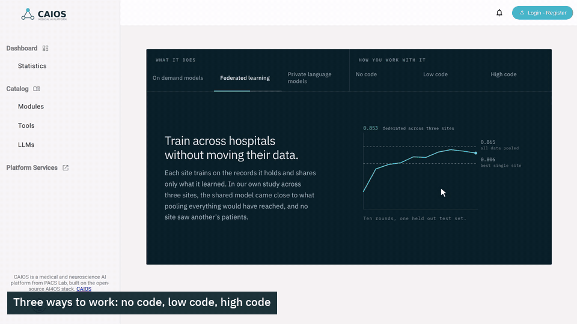
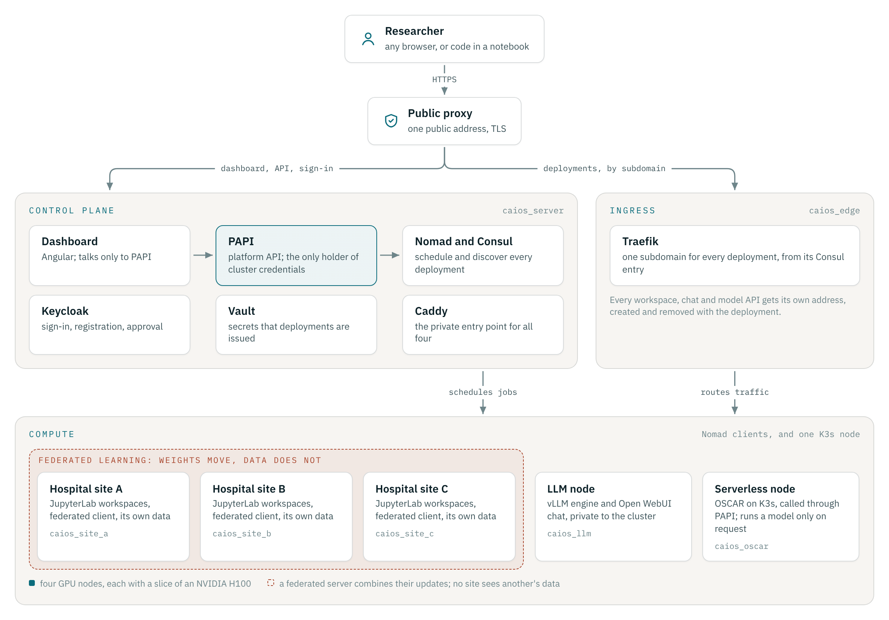

<p align="center">
  <picture>
    <source media="(prefers-color-scheme: dark)" srcset="docs/assets/caios-logo-dark.png">
    
  </picture>
</p>

<p align="center">
  <strong>Private AI infrastructure for medical and neuroscience research, operated in Canada.</strong>
</p>

<p align="center">
  <a href="https://github.com/AlirezaAbedinii/CAIOS/actions/workflows/ci.yml"></a>
  <a href="LICENSE"></a>
  <a href="https://github.com/ai4os"></a>
  <a href="https://github.com/AlirezaAbedinii/CAIOS/releases/tag/demo-2026-09"></a>
</p>

<p align="center">
  <a href="#demo"></a>
</p>

CAIOS gives research groups one place to build, train and use AI models without
handing their data to a commercial service. It is a Canadian deployment of the
open-source [AI4OS](https://docs.ai4os.eu/) stack on a GPU cluster on Compute
Canada's Arbutus cloud, with a curated medical catalogue and federated learning
across three simulated hospital sites.

| | |
|---|---|
| **No code** | Pick an open language model from the catalogue, fill in a short form, and chat with it at its own private address. |
| **Low code** | Publish a model as a serverless endpoint that only runs when a request arrives. |
| **High code** | Open the same model as a JupyterLab workspace, with its own code and environment. |
| **Federated learning** | Train one model across three hospital sites. Each site's scans stay on its own machine; only model weights move. |

## Demo

https://github.com/user-attachments/assets/f36b1e7f-66b1-4969-ad23-d51326ee3f9a

A four-minute narrated walkthrough, recorded on the live platform. Full-resolution
files and captions are on the [release page](https://github.com/AlirezaAbedinii/CAIOS/releases/tag/demo-2026-09),
and every word is in the [transcript](demo/recording/transcript.md). The video is
made by a script, so any beat can be re-recorded with one command
([how](demo/recording/README.md)).

Measured on this cluster, brain tumour MRI classification: **0.853** accuracy
federated across the three sites, against **0.806** for the best hospital on its
own and **0.865** with every scan pooled centrally ([how](demo/fl/README.md)).

## How it works

<p align="center">
  <picture>
    <source media="(prefers-color-scheme: dark)" srcset="docs/assets/architecture-dark.png">
    
  </picture>
</p>

- **Nomad, not Kubernetes.** Every deployment is a Nomad job rendered by PAPI, the
  platform API. PAPI is the only component holding cluster credentials, and the
  dashboard talks only to PAPI.
- **Seven VMs on Arbutus.** A control plane, an ingress node, three hospital sites
  and an LLM node, each with a slice of an NVIDIA H100, plus a 16-core node for
  serverless inference.
- **Upstream, not a fork.** Every change to AI4OS is configuration in `configs/` or
  a documented patch in `patches/`, applied to pinned upstream sources.

More in [infrastructure](docs/infrastructure.md), [concepts](docs/concepts.md) and
[decisions](docs/decisions.md).

## Quick start

CAIOS runs on OpenStack VMs (Ubuntu 22.04, from a GPU-enabled snapshot) and is
deployed from the control-plane node, which needs SSH access to the others
([setup](docs/ssh-setup.md)).

```bash
git clone https://github.com/AlirezaAbedinii/CAIOS.git && cd CAIOS
cp configs/env/caios.env.template configs/env/caios.env   # hosts, domain, secrets

bash scripts/clone-vendor.sh        # pinned upstream, read-only, into vendor/
bash scripts/apply-patches.sh       # our patches, into build/
bash scripts/render-configs.sh
bash scripts/make-traefik-certs.sh

cd ansible && ansible-galaxy install grycap.docker
ansible-playbook playbook-control-plane.yml playbook-consul.yml playbook-nomad.yml
cd .. && bash scripts/verify-cluster.sh   # can the cluster schedule anything?

bash scripts/build-dashboard.sh
cd compose && docker compose --env-file ../configs/env/caios.env up -d
```

> [!WARNING]
> `playbook-nomad.yml` formats `/dev/vdb` on the three site nodes, erasing their
> `/mnt`. Read `ansible/inventory/hosts.ini` first.

Then sign in to the dashboard and deploy from the catalogue. The
[runbook](docs/runbook.md) covers day-to-day operation and the federated demo, and
`bash scripts/run-tests.sh` runs the unit tests offline.

## Documentation

[Runbook](docs/runbook.md) · [Infrastructure](docs/infrastructure.md) ·
[Decisions](docs/decisions.md) · [Demo script](docs/demo-script.md) ·
[All documents](docs/README.md) · [Contributing](CONTRIBUTING.md) ·
[Security](SECURITY.md)

## License

Apache 2.0, see [LICENSE](LICENSE). CAIOS is a project of PACS Lab, York
University, built on [AI4OS](https://github.com/ai4os) by the AI4EOSC project,
also Apache 2.0; [NOTICE](NOTICE) carries the attribution. Models in the catalogue
keep their own licences ([details](docs/licensing.md)).
