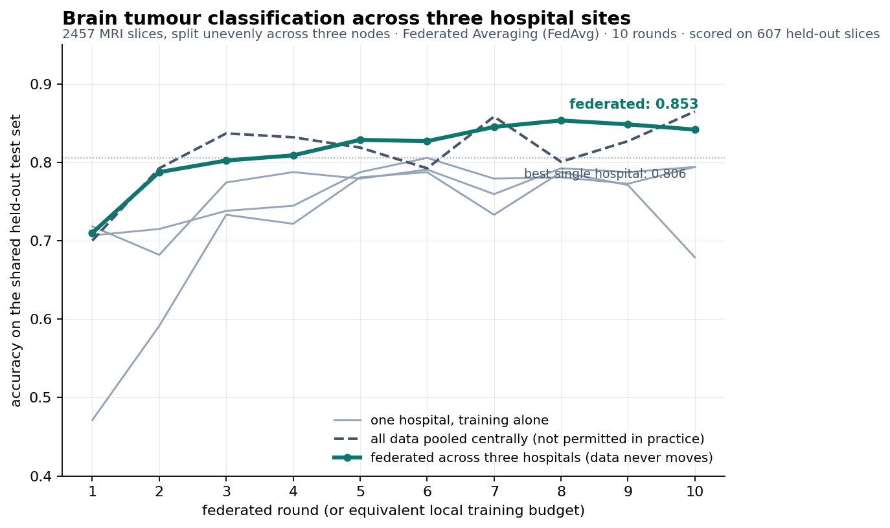

# CAIOS — Project Status

**Canadian Artificial Intelligence Operating System**
A research platform for medical and neuroscience AI, running on our own GPU nodes
on Compute Canada.

*Week of 12–19 August 2026. Previous update: 12 August.*

---

## The headline

> **The platform is finished and the headline feature works.** A model now trains
> across three simulated hospital sites, on three separate physical machines,
> where no image ever leaves the machine it started on — and it beats what any
> one hospital could achieve alone.

Last week we had proven infrastructure and nothing a visitor would recognise as a
product. This week there is a working product: a researcher logs in through a
browser, sees a catalogue aimed at their field, launches a model onto a GPU, and
runs a federated training across three sites.

All five planned stages are complete. Nothing is blocking.

---

## The result



Read the chart as three answers to the same question — *how well can we classify
brain tumours from MRI?*

| | Accuracy | What it means |
|---|---|---|
| One hospital, training on its own data | **0.806** (best of three) | What each site can do today, alone. |
| All data pooled in one place | **0.865** | The ideal — and not legally possible. |
| **Federated across all three** | **0.853** | Close to the ideal. No data moved. |

**Federated learning closed 81% of the gap** between working alone and pooling
everything, while every hospital's data stayed where it was.

Three things make that number honest rather than decorative, and they are the
first things a reviewer would check:

- **The three hospitals hold genuinely different patients.** We split the data
  unevenly on purpose — one site weighted toward one tumour type, another toward
  a second, the third mixed — because a tidy even split would have made the
  demonstration prove nothing.
- **Nobody is scored on their own patients.** All three lines are measured on the
  same held-out set of scans, set aside before the sites were formed, containing
  no patient who appears at any site.
- **Everyone gets the same training budget.** The comparison is between methods,
  not between how long each one was allowed to train.

The data is a public brain-tumour MRI set — 3,064 scans from 233 patients,
openly licensed. No patient data anywhere, at any point.

---

## State of the work

```
Foundation & infrastructure   ██████████████████████  100%
User accounts & security      ██████████████████████  100%
Web dashboard & control       ██████████████████████  100%
Federated learning demo       ██████████████████████  100%
Medical content & branding    ██████████████████████  100%

Toward a working demo         ██████████████████████  100%
Including final polish        ██████████████████░░░░   ~80%
```

Last week this read 33%. The jump is real, but note what the remaining 20% is:
rehearsal, a proper web address, and recording. No unbuilt features.

| | Status |
|---|---|
| Five machines coordinated as one cluster | **Working** |
| Researchers log in with their own accounts | **Working** |
| Web dashboard, branded CAIOS | **Working** |
| Browse a catalogue and launch a model onto a GPU | **Working** |
| Every workload gets its own secure web address | **Working** |
| Federated learning across three sites | **Working** |
| Medical and neuroscience catalogue | **Working** |
| Live cluster usage statistics | **Working** |
| Trusted certificate on a real domain | Not yet — see below |
| Rehearsed and recorded walkthrough | Not yet — this week's work |

---

## Which models work?

Two separate answers, because there are two ways to get a model.

### 1. The catalogue: 9 models, curated from 46

The stock platform ships 46 models, roughly two thirds of them marine biology,
agriculture and remote sensing. That is the first thing a visitor looks at, so we
cut it to the ones a medical or neuroscience group would plausibly run on their
own data:

| Model | What it does |
|---|---|
| Retinopathy classifier | Diabetic retinopathy from retinal images |
| Image classifier (trainable) | **Train your own classifier on your own labelled images** |
| YOLO (trainable) | Detection, segmentation and classification |
| Faster R-CNN ×2 (trainable) | Object detection on your own data |
| Audio classifier (trainable) | Train your own — e.g. respiratory sounds |
| Body pose estimation | Gait, movement disorders, rehabilitation |
| Demo application | The "try it in one click" path |
| GPU benchmark | Confirms the hardware is doing what it claims |

The five *trainable* entries matter more than the named ones. A researcher with
their own labelled images uses those, and they carry no other field's branding.

### 2. Real neuroscience: 12 published models, deployable by ID

The platform can also deploy any model from **bioimage.io**, the community model
zoo, by its identifier and with no code written. We curated twelve, ordered so
the form opens on connectomics:

- **Circuit reconstruction from electron microscopy** — three different
  architectures on the same task, so two can be compared side by side. This is
  core neuroscience.
- **Mitochondria segmentation** — two models, including a generalist one.
- **Cell and nucleus segmentation** — including the single most-downloaded model
  in the catalogue (70,000 downloads), plus CellPose.
- **Denoising** for electron microscopy, **skeletal muscle fibre segmentation**
  from clinical histology, and a microscopy-tuned **Segment Anything**.

### One finding worth reporting

Upstream is documented as shipping two medical models. **It effectively ships
one.** The other — chest X-ray classification that speaks DICOM, on paper the
single most relevant model for us and the natural anchor for a PACS story — is
broken in a way that makes it undeployable, and the container image it points at
does not exist anywhere public. We dropped it rather than patch an immediate
error into a deployment that starts and dies in front of an audience.

The consequence is worth stating plainly: **the platform's medical and
neuroscience credibility rests on the bioimage.io loader, not on the stock
catalogue.** That is why the twelve curated models above are load-bearing rather
than a bonus — and it is why we brought that piece forward from the "later" list
into this week.

**A caveat on "work".** Everything above is live in the catalogue and configured.
We have deployed and run models end to end through the platform, and each model
here was assessed on its own description. What has not happened yet is a human
sitting down and clicking through all twenty-one in a browser. That is exactly
what this week's rehearsal is for, and it is the reason we are not calling the
project finished.

---

## What tools are available?

"Tools" are the deployable services, as distinct from AI models.

| Tool | What a researcher gets | Status |
|---|---|---|
| **Development environment** | A JupyterLab or VS Code workspace in the browser, with a real GPU attached, at its own web address | **Live and used** |
| **Federated learning server** | The coordinator for a multi-site training run | **Live — this is the headline** |
| **bioimage.io loader** | Deploys any of the twelve curated published models by ID | **Live** |
| Annotation tool (CVAT) | Labelling medical images | **Not available** — needs ~71 GB of memory on one machine; our largest has 34 GB |
| Second FL framework (NVIDIA FLARE) | An alternative to the one we use | Deferred — one framework tells the story |
| Local language-model service | A private chat assistant on our own hardware | Stretch goal, not started |

The GPU workspace is worth dwelling on: a researcher goes from a web page to a
terminal on an H100 in about ninety seconds, with no ticket and no administrator
involved. That alone is a change in how the lab works.

---

## How does federated learning actually work?

In plain terms, and it is simpler than it sounds.

1. **Everyone starts with the same blank model.** The coordinator hands out an
   identical untrained model to each hospital.
2. **Each hospital trains it on its own patients.** On its own machine, against
   data that never moves.
3. **Each sends back what it learned — not what it saw.** What travels is the
   adjusted model settings, a count of how many scans it trained on, and an
   accuracy number. No images, no records, no identifiers.
4. **The coordinator averages them** into one shared model, weighted by how much
   data each site contributed.
5. **Repeat.** Ten rounds, about thirty seconds in total. Each round the shared
   model gets better than any hospital's individual model.

Two properties we made structural rather than promised:

- **The three hospitals are three physically separate machines.** We changed how
  the cluster assigns work so the three sites cannot land on the same box. If
  they had, the accuracy numbers would be identical and the claim would be
  hollow.
- **Each site's package physically contains only its own data.** Site A's copy
  does not contain Site B's scans. That is verified as part of the build, not
  asserted in a slide.

**One thing we will say out loud rather than be caught on.** Reconstructing
training data from shared model updates is a real, published attack. This demo
does not defend against it. The platform ships the standard countermeasures and a
production deployment would turn them on; we have not, because they cost accuracy
and this is a demonstration of the mechanism. Better to state it than to be asked.

---

## Can you do it from the dashboard?

**Yes — with one honest qualification.**

Everything is *launched* from the dashboard: you pick the federated server from
the tools list, fill in a short form (how many sites must join before training
starts), and click deploy. Same for each hospital workspace. Nothing requires a
terminal on our side, and no command touches the cluster directly — the dashboard
sends the same requests our scripts do.

The qualification: once the workspaces are running, the training itself is
*started* by typing one command in each site's browser-based terminal — inside
the workspace the dashboard just gave you. That is how the platform is designed
upstream, and for the demo it is an advantage rather than a compromise: the
audience watches the rounds print, live, instead of staring at a progress bar.
The alternative mode runs it invisibly, which makes for a worse demonstration.

There is a script that recreates the whole four-part setup for rehearsal, so we
do not re-derive nine form fields from memory each time. It calls the same
interface the dashboard does, and on the day the clicking is real.

**What is not enforced yet:** a site is *chosen* at deployment time rather than
locked to a login. "We deployed this as Site B" rather than "Site B's account
physically cannot deploy anywhere else". The demonstration looks identical; the
claim is stronger with the latter, which is a day of work and top of the list
below.

---

## What is left

Roughly three days of work, none of it risky.

1. **Rehearse the walkthrough end to end in a browser** — twice, the second time
   from a clean start. Every piece is verified individually, which is not the
   same as verified together. *(1.5 days, this week)*
2. **A real domain and certificate** *(half a day)* — see the question below.
3. **Record it** — insurance as much as a deliverable.

Then, in value order, if there is time: lock each site to its own login;
shared storage so datasets are mounted rather than copied; annotation if a larger
machine appears; a second federated framework.

---

## Your questions from last week

**Answered, thank you — no longer open:**

- **PACS Lab branding** is now live in the platform, linked back to the lab.
  Along the way we removed an EU funding flag that the stock software was
  displaying on every page, which we have no claim to.
- **Federated learning is the headline**, and everything is built around it.
- **Brain MRI** is the disease area, now baked into the demo narrative — the
  chart, the site case-mix story and the script all assume it. Still swappable,
  but no longer free.

**Still open, and one has a short fuse:**

### 1. Can we buy a domain name? (~$15/year) — *the only one that touches the recording*

Without one, anyone opening the platform — or watching the recording — sees a
browser security warning first. We have solved this internally with our own
certificate authority, but that trust does not extend to anyone else's computer.

This is now the *first* thing a reviewer would see, and it is half a day of work
once a domain exists. Domains take a day or two to become usable, so this is
worth a yes or no this week.

### 2. Does the Statistics page need historical usage?

Still the shortest-fuse question. The page correctly shows live activity. Showing
*historical* graphs requires a service collecting data continuously for days — so
if it is wanted, collection has to start almost immediately to have anything to
show by demo day.

**Default in effect:** live data only.

### 3. Live demonstration, or recorded?

We recommend recording regardless. A live external demonstration additionally
requires requesting a public address, which has lead time — so it is worth
deciding early even though the work is small.

### 4. Is this a demo, or something the lab keeps running?

Not urgent, but it changes two decisions about how credentials are stored. If
CAIOS is meant to survive past the grant application, we should know now rather
than rebuild those pieces later.

### 5. One more machine with a lot of memory?

Would restore the annotation tool. Not on the critical path, and the demo does
not depend on it.

---

## Summary

The platform is built, branded, and does the thing the grant is about. A
federated training runs across three hospital sites and gets within 1.2
percentage points of what pooling all the data would give, without any data
moving.

What is left is rehearsal and presentation, not construction.

**The one decision worth making this week is the domain name** — it is fifteen
dollars, half a day, and it is the difference between a recording that opens on
the platform and one that opens on a security warning.
